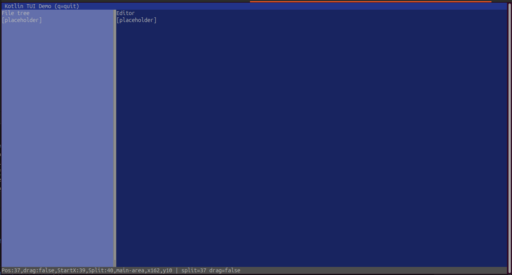

# Terminal UI Reactive Framework (Kotlin)

## The stated goal is to be able to __develop__ `react` applications with `kotlin`(*) programming language and its' std libraary  __employing__ similar if not identical __component definitions__ we do with `react js/ts` that will run on the jvm

A compact but powerful reactive UI framework for **VT/ANSI terminal applications**.
Designed with:

* Declarative components
* React-like hooks
* Full redraw on each frame
* Deterministic component identity
* Explicit event dispatch
* Pluggable renderer interfaces
* Easy testability through a string snapshot renderer

All of this lives in **a single Kotlin file**, with clear block-structured regions.

----

# Table of Contents

1. [Overview](#overview)
2. [Goals](#goals)
3. [Non-Goals](#non-goals)
4. [Architecture](#architecture)
5. [Functional Components](#functional-components)
6. [State Hooks](#state-hooks)
7. [DOM Nodes](#dom-nodes)
8. [Style System](#style-system)
9. [Layout Model](#layout-model)
10. [Event System](#event-system)
11. [Renderers](#renderers)

    * [AnsiCanvasRenderer](#ansicanvasrenderer)
    * [StringSnapshotRenderer](#stringsnapshotrenderer)
    * [NoopRenderer](#nooprenderer)
12. [Application Runtime (`runApp`)](#application-runtime-runapp)
13. [Building an App](#building-an-app)
14. [Testing](#testing)
15. [Extending the Framework](#extending-the-framework)

---

# Overview

This framework provides a **reactive, component-based terminal UI** system using:

* Declarative components that return a **DOMNode tree**
* A `useState` hook for local component state
* Full re-rendering every frame (no diffing)
* Component identity preserved via call-site hashing
* Explicit terminal drawing via a pluggable `CanvasRenderer`
* Unified event data structure
* Mouse, keyboard, and resize support
* Surface-level stylesheet system
* Absolute-edge layout (no automatic layout)

The design emphasizes **predictability**, **determinism**, and **explicit control**.

---

# Goals

* Simple mental model similar to React’s “pure function components”
* Zero hidden behaviors
* Suitable for terminal environments (Termux, Linux console, SSH, etc.)
* Easy to test (snapshot renderer)
* Explicit lifecycle control (enter/exit terminal modes)
* Deterministic state identity

---

# Non-Goals

* No layout engine (no flexbox, grid, constraints, etc.)
* No partial diffing (full re-render each frame)
* No cross-thread async hooks
* No built-in widgets library
* No retained-mode graphics

---

# Architecture

The architecture revolves around these components:

* **ComponentTreeManager**
  Manages component identity and hook slot storage.

* **renderComponent**
  Applies a component with identity.

* **DOMNode**
  Pure data object representing terminal UI.

* **StyleSet / StyleSheet**
  Optional CSS-like styling system.

* **CanvasRenderer**
  Abstract interface controlling drawing + event polling + terminal lifecycle.

* **runApp()**
  The main runtime loop:

    * poll events
    * dispatch events
    * rebuild tree
    * draw tree
    * handle exit conditions

---

# Functional Components

A component is a *pure function* returning a DOM tree:

```kotlin
fun App(tree: ComponentTreeManager, cols: Int, rows: Int): DOMNode =
    renderComponent(tree) {
        // return tree of DOMNode
    }
```

Each call is stateless — all state lives in ComponentInstance objects.

---

# State Hooks

The framework supports:

```kotlin
val (value, setValue) = useState { initialValue }
```

* Hook ordering determines which slot is used
* Identity assigned based on:

    * parent component
    * call-site hash
    * optional key for list children

---

# DOM Nodes

The root object of the UI tree.

```kotlin
data class DOMNode(
    val tag: String,
    val text: String? = null,
    val styleId: String? = null,
    val style: StyleSet = StyleSet(),
    val id: String? = null,

    val onMouseDown: ((UIEvent) -> Unit)? = null,
    val onMouseUp:   ((UIEvent) -> Unit)? = null,
    val onMouseMove: ((UIEvent) -> Unit)? = null,
    val onMouseScroll: ((UIEvent) -> Unit)? = null,
    val onKeyDown: ((UIEvent) -> Unit)? = null,
    val onKeyUp:   ((UIEvent) -> Unit)? = null,
    val onFocusGained: ((UIEvent) -> Unit)? = null,
    val onFocusLost:   ((UIEvent) -> Unit)? = null,
    val onResize: ((UIEvent) -> Unit)? = null,

    val children: List<DOMNode> = emptyList()
)
```

---

# Style System

A minimal CSS-like styling system:

```kotlin
data class StyleSet(
    var top: Int? = null,
    var left: Int? = null,
    var bottom: Int? = null,
    var right: Int? = null,
    var bg: Color? = null,
    var fg: Color? = null,
    var textDecoration: String? = null,
    var borderSet: String? = null,
    var lineSet: String? = null
)
```

* Coordinates are **relative to parent**
* `null = 0`
* No layout solving
* Direct absolute edges

---

# Layout Model

Each node defines an explicit box:

```
x1 = parentX + left
y1 = parentY + top
x2 = parentX + right
y2 = parentY + bottom

width  = x2 - x1
height = y2 - y1
```

No layout inference is ever applied.

---

# Event System

All events share **one unified structure**:

```kotlin
data class UIEvent(
    val kind: String,
    val x: Int? = null,
    val y: Int? = null,
    val button: Int? = null,
    val scrollDelta: Int? = null,
    val key: String? = null,
    val focusId: String? = null,
    val cols: Int? = null,
    val rows: Int? = null
)
```

Examples:

```
mouse_down(x=10, y=5, button=0)
key_down(key="q")
resize(cols=120, rows=40)
```

---

# Renderers

All renderers implement:

```kotlin
interface CanvasRenderer {
    fun clear()
    fun setColor(r: Int, g: Int, b: Int)
    fun setBackgroundColor(r: Int, g: Int, b: Int)
    fun bold(enabled: Boolean)
    fun italic(enabled: Boolean)
    fun underline(enabled: Boolean)
    fun blink(enabled: Boolean)
    fun drawRect(x: Int, y: Int, width: Int, height: Int)
    fun drawText(x: Int, y: Int, text: String)
    fun setCursorPosition(x: Int, y: Int)
    fun flush()

    fun pollEvent(): UIEvent?
    fun tryPollEvent(): UIEvent?

    fun enableMouseTracking()
    fun disableMouseTracking()
    fun hideCursor()
    fun showCursor()
    fun resetAttributes()

    fun isRunning(): Boolean
    fun requestExit()
    fun shutdown()
}
```

---

# **AnsiCanvasRenderer**

A true VT terminal renderer:

* ANSI cursor movement
* RGB colors
* Bold/italic/underline/blink
* Rectangles (filled)
* Text drawing
* Mouse events (1000/1002/1003/1006 modes)
* Keyboard events
* Resize events
* Cursor hide/show
* Attribute reset
* Full cleanup on shutdown

This is used for **real terminal UIs**.

---

# **StringSnapshotRenderer**

For testing:

* Renders text and rectangles into an in-memory 2D buffer
* No terminal control
* No events
* `snapshot()` returns a deterministic string
* Ideal for snapshot tests

---

# **NoopRenderer**

A void renderer:

* No drawing
* No events
* `isRunning()` can be externally turned off
* Ideal for logic-only tests or headless usage

---

# Application Runtime (`runApp`)

This is the **main loop** used by all applications.

It contains:

* Safe event polling
* Hardwired exit triggers
* Time-based failsafe
* Dead-cycle failsafe
* Guaranteed cleanup in `finally`
* Full redraw every frame

Example signature:

```kotlin
runApp(renderer) { tree: ComponentTreeManager ->
    App(tree, renderer.cols(), renderer.rows())
}
```

---

# **Building an App**

Your real application entry point now looks like:

```kotlin
fun main() {
    val renderer = NoopRenderer(cols = 120, rows = 40)
    runApp(renderer){ tree : ComponentTreeManager ->
        App(tree, renderer.cols(), renderer.rows())
    }
}
```

Where `App` is your root component:

```kotlin
fun App(tree: ComponentTreeManager, cols: Int, rows: Int): DOMNode =
    renderComponent(tree) {
        DOMNode(
            tag = "root",
            children = listOf(
                counterComponent(tree, key="c1"),
                counterComponent(tree, key="c2"),
                listOfCounters(tree, listOf(1,2,3))
            )
        )
    }
```

This demonstrates:

* Composition
* Multiple instances
* List with keys

---

# Testing

Snapshot testing:

```kotlin
@Test
fun testLayout() {
    val renderer = StringSnapshotRenderer(40,10)
    val tree = ComponentTreeManager()

    tree.beginFrame()
    val root = App(tree, 40, 10)
    tree.endFrame()

    renderer.clear()
    renderDomTree(renderer, root)
    renderer.flush()

    val snap = renderer.snapshot()
    assertTrue(snap.contains("Count"))
}
```

---

# Extending the Framework

You can add:

* Focus manager (tab cycling, default focus, focus rings)
* Border renderer (`borderSet`, line-set graphics)
* Stylesheet cascade for entire DOM recursion
* Memoized components (skip rendering when values equal)
* Derived layout helpers (center, grid, flex-like helpers)


The core is intentionally minimal.

---
